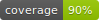

# Product Feedback API

- This is a project that is heavily inspired from the website frontendmentor.io

- The original project link is provided here: https://www.frontendmentor.io/challenges/product-feedback-app-wbvUYqjR6

- This is the backend portion of the project

- Primarily uses Django and DjangoRestFramework in order to build the API

- Notable features:
    - Automated testing of Models and Views via GitHub Actions
    - User Authentication

